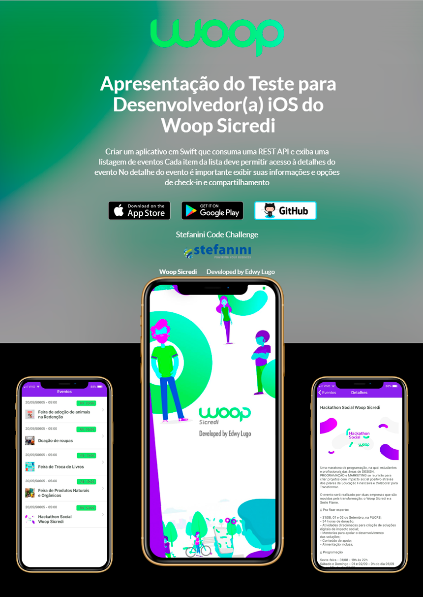

# WoopSicredi
## Objetivo:
Criar um aplicativo em Swift que consuma uma REST API e exiba uma listagem de eventos Cada item da lista deve permitir acesso à detalhes do evento No detalhe do evento é importante exibir suas informações e opções de check-in e compartilhamento

## Requisitos

- Xcode 
- Versão: iOS 12.2

## Pods
 - pod 'Alamofire'
 - pod 'SwiftyJSON'
 - pod 'Kingfisher'

## Instalação e Configurações
Siga as instruções para rodar o projeto.
1. Clone o repositório.
2. Instale o Xcode.
3. Abra o projeto. Abra o Xcode, click em 'Open... e selecione o projeto woopsicredi.xcworkspace. 
4. Rode o app. Click 'Run'.

## Screenshots: 

